## Hi there 👋

- 🌱 I’m currently learning Computer Science

**Languages and Tools:**

<code></code>
<code></code>
<code></code>
<code></code>
<code></code>
<code></code>
<code></code>  
<code></code>

 

